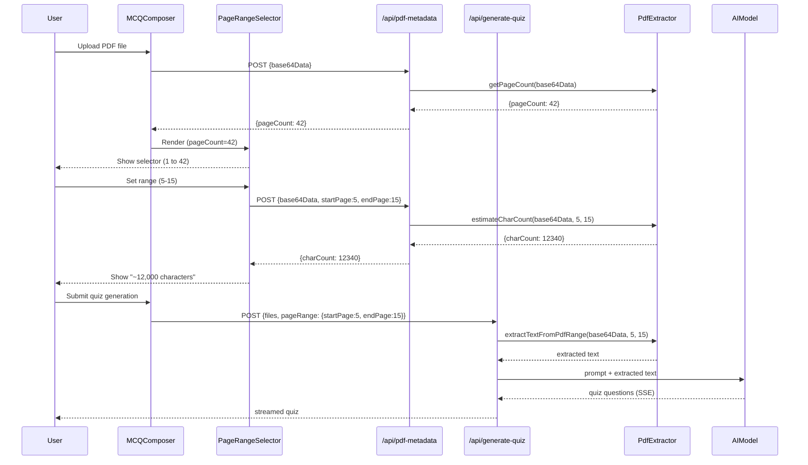

# Design Document: PDF Page Range Selector

## Overview

This feature adds a page range selector to the Study Buddy MCQ quiz generator, allowing users to upload large PDFs and select specific pages for text extraction and quiz generation. The design leverages the existing pdf-parse v2 library's `ParseParameters.first` and `ParseParameters.last` fields to extract text from a specific page range without loading the entire document's text into memory.

The feature introduces:
1. A new API endpoint for PDF metadata (page count + character estimation)
2. Modifications to the existing `pdf-extractor.ts` to support page-range extraction
3. A conditional file size limit increase (10 MB → 50 MB) for PDFs with page range parameters
4. A React component (`PageRangeSelector`) rendered inline in the MCQ Composer after PDF upload

## Architecture



## Components and Interfaces

### 1. PDF Extractor Enhancements (`src/lib/quiz/pdf-extractor.ts`)

New and modified functions:

```typescript
/**
 * Gets the total page count of a PDF without extracting text.
 */
export async function getPageCount(base64Data: string): Promise<number>;

/**
 * Extracts text from a specific page range (1-indexed, inclusive).
 * Uses pdf-parse v2 ParseParameters.first and ParseParameters.last.
 */
export async function extractTextFromPdfRange(
  base64Data: string,
  startPage: number,
  endPage: number
): Promise<ExtractionResult>;

/**
 * Estimates character count for a page range without full processing overhead.
 * Reuses extractTextFromPdfRange internally.
 */
export async function estimateCharCount(
  base64Data: string,
  startPage: number,
  endPage: number
): Promise<number>;
```

### 2. Page Range Validation (`src/lib/quiz/page-range-validator.ts`)

A pure validation module for page range inputs:

```typescript
export interface PageRange {
  startPage: number;
  endPage: number;
}

export interface PageRangeValidationResult {
  valid: boolean;
  error?: string;
}

/**
 * Validates a page range against constraints.
 * Rules:
 * - startPage and endPage must be integers
 * - startPage >= 1
 * - endPage >= startPage
 * - endPage <= totalPages (when totalPages is provided)
 */
export function validatePageRange(
  range: PageRange,
  totalPages?: number
): PageRangeValidationResult;
```

### 3. File Router Enhancement (`src/lib/quiz/file-router.ts`)

Modified `validateAndFormatFiles` to accept an optional `hasPageRange` flag:

```typescript
export function validateAndFormatFiles(
  files: FilePayload[],
  options?: { hasPageRange?: boolean }
): FormattedFilePart[];
```

When `hasPageRange` is `true`, PDF files get a 50 MB limit instead of 10 MB. Image files and PDFs without page range retain the 10 MB limit.

### 4. PDF Metadata API Route (`src/app/api/pdf-metadata/route.ts`)

New endpoint for client-side page count detection and character estimation:

```typescript
// POST /api/pdf-metadata
// Request body:
interface PdfMetadataRequest {
  base64Data: string;       // base64-encoded PDF
  mimeType: string;         // must be "application/pdf"
  startPage?: number;       // optional, for char count estimation
  endPage?: number;         // optional, for char count estimation
}

// Response:
interface PdfMetadataResponse {
  pageCount: number;
  charCount?: number;       // present only when startPage/endPage provided
}
```

### 5. Page Range Selector Component (`src/components/PageRangeSelector.tsx`)

React component rendered inline below each uploaded PDF file:

```typescript
interface PageRangeSelectorProps {
  fileIndex: number;
  base64Data: string;
  onRangeChange: (fileIndex: number, range: PageRange | null) => void;
}
```

Features:
- Fetches page count on mount via `/api/pdf-metadata`
- Two number inputs (start page, end page) with inline validation
- Displays total page count label ("of 42 pages")
- Debounced character count estimation (500ms after valid range change)
- Warning messages for too-large (>100k chars) or too-small (<200 chars) selections
- Loading states for both page count detection and character estimation

### 6. Generate Quiz Route Modifications (`src/app/api/generate-quiz/route.ts`)

Extended request payload:

```typescript
interface GenerateQuizRequest {
  text?: string;
  files?: FilePayload[];
  modelId?: string;
  complexity?: string;
  count?: number;
  aiAutoCount?: boolean;
  pageRanges?: Record<number, PageRange>;  // keyed by file index
}
```

When `pageRanges` is present:
1. Apply 50 MB limit for PDF files via `validateAndFormatFiles`
2. For each PDF with a page range, use `extractTextFromPdfRange` instead of sending raw PDF to AI
3. Combine extracted text with user-provided text in the prompt

### 7. useQuizStream Hook Extension (`src/hooks/useQuizStream.ts`)

Extended payload interface:

```typescript
export interface QuizGeneratePayload {
  text?: string;
  files?: Array<{ inlineData: { mimeType: string; data: string } }>;
  modelId?: string;
  complexity?: string;
  count?: number;
  aiAutoCount?: boolean;
  pageRanges?: Record<number, { startPage: number; endPage: number }>;
}
```

## Data Models

### Extended Types (`src/lib/quiz/types.ts`)

```typescript
export interface PageRange {
  startPage: number;  // 1-indexed, inclusive
  endPage: number;    // 1-indexed, inclusive
}

export interface PdfMetadataRequest {
  base64Data: string;
  mimeType: string;
  startPage?: number;
  endPage?: number;
}

export interface PdfMetadataResponse {
  pageCount: number;
  charCount?: number;
}
```

### pdf-parse v2 Integration

The existing `PDFParse` class from pdf-parse v2 supports page-range extraction via `ParseParameters`:

```typescript
// Extract pages 5-15 (inclusive, 1-indexed)
const parser = new PDFParse({ data: new Uint8Array(buffer) });
const textResult = await parser.getText({ first: 5, last: 15 });
// textResult.pages contains PageTextResult[] for pages 5-15
// textResult.text contains concatenated text
// textResult.total contains total page count of the document
```

Key insight: `TextResult.total` always returns the total page count of the document regardless of the `first`/`last` parameters, which means we can get the page count from any `getText()` call (even with `first: 1, last: 1` for efficiency).

## Correctness Properties

*A property is a characteristic or behavior that should hold true across all valid executions of a system — essentially, a formal statement about what the system should do. Properties serve as the bridge between human-readable specifications and machine-verifiable correctness guarantees.*

### Property 1: Page range validation correctness

*For any* tuple (startPage, endPage, totalPages) where startPage and endPage are integers: the validation function returns valid if and only if startPage >= 1 AND endPage >= startPage AND endPage <= totalPages. For any non-integer value (float, string, null) as startPage or endPage, validation SHALL return invalid with an error indicating values must be integers.

**Validates: Requirements 2.2, 2.5, 3.5, 3.6, 7.4, 7.5**

### Property 2: Conditional file size limit

*For any* file with a decoded size in bytes and a `hasPageRange` boolean flag: if the file is a PDF and `hasPageRange` is true, the file SHALL be accepted if and only if its size is ≤ 52,428,800 bytes (50 MB); if the file is a PDF and `hasPageRange` is false, or if the file is an image, the file SHALL be accepted if and only if its size is ≤ 10,485,760 bytes (10 MB). Files exceeding the applicable limit SHALL produce a FileSizeError.

**Validates: Requirements 4.1, 4.2, 4.3, 4.4**

### Property 3: Page range extraction returns correct pages

*For any* valid PDF document with N pages and any valid range (startPage, endPage) where 1 ≤ startPage ≤ endPage ≤ N, `extractTextFromPdfRange` SHALL return text that equals the concatenation of individual page texts for pages startPage through endPage (inclusive), joined by newline characters in ascending page order.

**Validates: Requirements 3.1, 3.2**

### Property 4: Character count warning thresholds

*For any* estimated character count value: if the count exceeds 100,000, the system SHALL display a "too large" warning; if the count is below 200, the system SHALL display a "too little" warning; otherwise no warning SHALL be displayed.

**Validates: Requirements 5.3, 5.4**

### Property 5: Selector count equals PDF file count

*For any* list of uploaded files with varying MIME types, the number of PageRangeSelector instances rendered SHALL equal the number of files with MIME type `application/pdf`. Files with any other MIME type SHALL NOT have a PageRangeSelector.

**Validates: Requirements 6.1, 6.2**

### Property 6: Page count detection returns total pages

*For any* valid PDF document, `getPageCount` SHALL return a positive integer equal to the total number of pages in the document, regardless of document size or content.

**Validates: Requirements 1.1**

### Property 7: Default page range initialization

*For any* positive integer pageCount returned from page count detection, the PageRangeSelector SHALL initialize with startPage = 1 and endPage = pageCount.

**Validates: Requirements 2.3**

## Error Handling

### Client-Side Errors

| Scenario | Handling |
|----------|----------|
| PDF upload fails metadata fetch | Show error toast, do not render PageRangeSelector |
| Invalid page range input | Inline validation error below inputs, disable generate button |
| Character estimation timeout (>5s) | Show "Estimate unavailable" message, allow quiz generation |
| Character estimation API error | Show "Estimate unavailable" message, allow quiz generation |
| Network error during estimation | Show "Estimate unavailable" message, allow quiz generation |

### Server-Side Errors

| Scenario | HTTP Status | Response |
|----------|-------------|----------|
| Corrupted/unreadable PDF | 422 | `{ error: "Failed to process PDF: <reason>" }` |
| Password-protected PDF | 422 | `{ error: "Failed to process PDF: password required" }` |
| Zero-page PDF | 422 | `{ error: "PDF has no extractable pages" }` |
| Invalid page range (start > end, < 1) | 400 | `{ error: "Invalid page range: startPage must be ≤ endPage and ≥ 1" }` |
| Page range exceeds document | 400 | `{ error: "Page range out of bounds: document has N pages" }` |
| Non-integer page values | 400 | `{ error: "Page values must be integers" }` |
| PDF exceeds 50 MB (with page range) | 413 | `{ error: "File exceeds maximum allowed size of 50 MB..." }` |
| PDF exceeds 10 MB (without page range) | 413 | `{ error: "File exceeds maximum allowed size of 10 MB..." }` |
| Selected pages have no text | 422 | `{ error: "Selected pages contain no extractable text" }` |

### Error Propagation

- `pdf-extractor.ts` throws typed errors that bubble up to the API route
- API routes catch errors and return appropriate HTTP status codes
- Client-side hooks receive error events via SSE or JSON error responses
- The `PageRangeSelector` component handles its own API errors independently from quiz generation

## Testing Strategy

### Property-Based Tests (using fast-check + vitest)

Property-based testing is appropriate for this feature because the core logic involves pure validation functions and data transformations with large input spaces.

**Library**: `fast-check` (already in devDependencies)
**Runner**: `vitest` (already configured)
**Minimum iterations**: 100 per property

Tests to implement:

1. **Page range validation** — Generate random (startPage, endPage, totalPages) tuples and verify validation correctness
   - Tag: `Feature: pdf-page-range-selector, Property 1: Page range validation correctness`

2. **Conditional file size limit** — Generate random file sizes, MIME types, and hasPageRange flags; verify correct accept/reject
   - Tag: `Feature: pdf-page-range-selector, Property 2: Conditional file size limit`

3. **Page range extraction** — Mock PDFParse to return per-page text; verify concatenation for random ranges
   - Tag: `Feature: pdf-page-range-selector, Property 3: Page range extraction returns correct pages`

4. **Character count warnings** — Generate random character counts; verify correct warning classification
   - Tag: `Feature: pdf-page-range-selector, Property 4: Character count warning thresholds`

5. **Selector count** — Generate random file lists with varying MIME types; verify selector count equals PDF count
   - Tag: `Feature: pdf-page-range-selector, Property 5: Selector count equals PDF file count`

6. **Page count detection** — Mock PDFParse with random page counts; verify getPageCount returns correct value
   - Tag: `Feature: pdf-page-range-selector, Property 6: Page count detection returns total pages`

7. **Default initialization** — Generate random page counts; verify defaults are (1, pageCount)
   - Tag: `Feature: pdf-page-range-selector, Property 7: Default page range initialization`

### Unit Tests (example-based)

- Corrupted PDF error handling (Requirement 1.2)
- Zero-page PDF error handling (Requirement 1.4)
- Empty text extraction error (Requirement 3.3)
- PageRangeSelector renders after page count loads (Requirement 2.1)
- Page count label displays correctly (Requirement 2.4)
- Validation error display and button disable/enable (Requirement 2.6)
- Loading indicator during estimation (Requirement 5.2)
- Estimation failure graceful handling (Requirement 5.5)
- File removal hides correct selector (Requirements 6.3, 6.4)
- Request payload includes page range (Requirement 7.1)
- Full extraction when no page range (Requirement 7.3)

### Integration Tests

- End-to-end: upload PDF → get page count → set range → generate quiz with extracted text
- PDF metadata API response time (Requirement 1.3)
- Character estimation API timeout handling (Requirement 5.5)
- Server passes page range to extractor correctly (Requirement 7.2)

