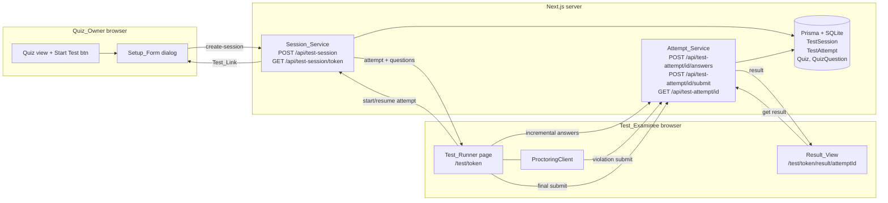
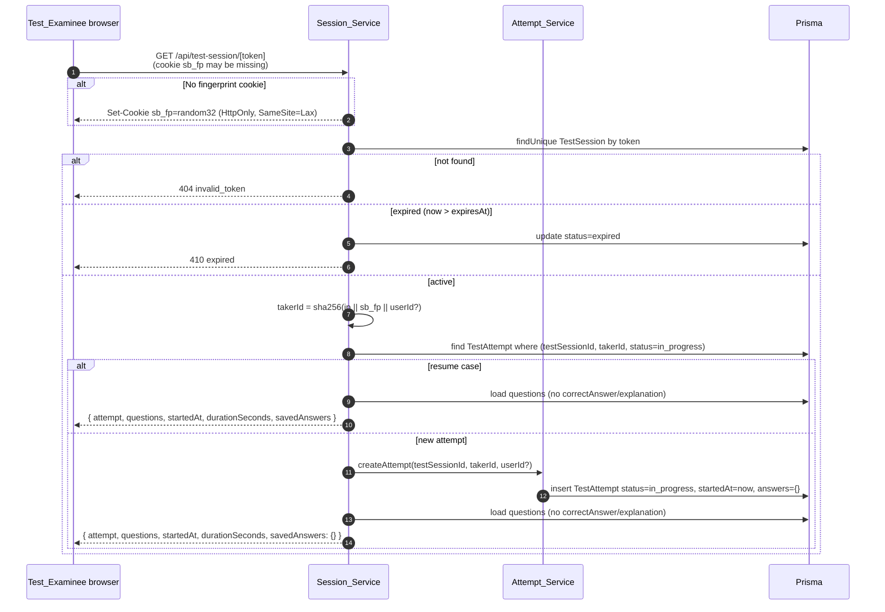
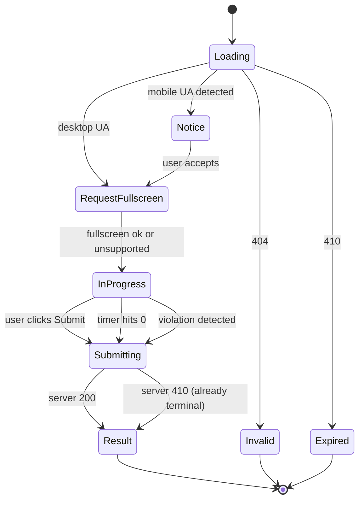
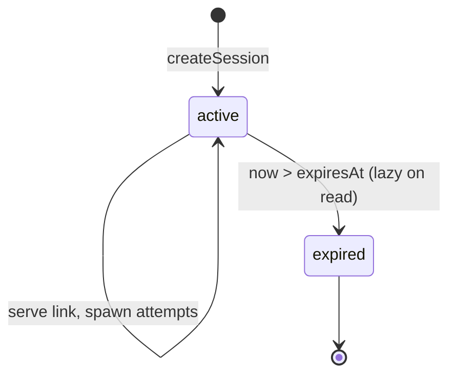
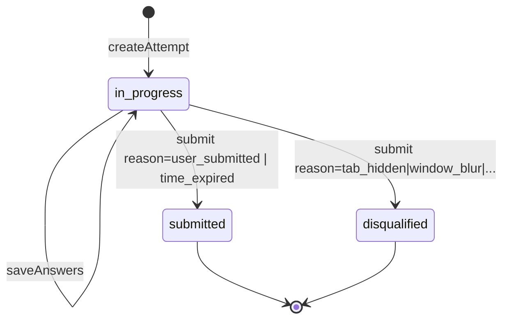

# Design Document

## Overview

The Proctored Quiz Test Mode adds a timed, anti-cheating test runner alongside the existing `/mcq/[id]` practice flow. The feature is composed of three logical pieces:

1. **Setup_Form** — a Quiz_Owner-facing dialog launched from a Quiz view that creates a Test_Session and produces a shareable Test_Link.
2. **Test_Runner** — a public, locked, full-screen page at `/test/[token]` that resolves a Test_Link, creates or resumes a per-Examinee Test_Attempt, runs the per-Attempt Timer, and continuously monitors the browser for proctoring violations. Any single violation immediately ends the Attempt as Disqualified.
3. **Result_View** — a per-Attempt scoring page at `/test/[token]/result/[attemptId]` that shows the score, percentage, per-question correctness, explanations, and a disqualification banner when applicable. Quiz_Owners additionally see a leaderboard of all Attempts on their Test_Session.

The design favors small, well-bounded server services (`Session_Service`, `Attempt_Service`) backed by two new Prisma models (`TestSession`, `TestAttempt`) and a thin client-side proctoring layer (`ProctoringClient`). The existing `/mcq/[id]` route, the `Quiz` and `QuizQuestion` models, and the `useQuizStream` hook are not modified.

### Key design decisions and rationale

- **Multi-use Test_Link, per-Examinee Attempt.** A single Test_Session can spawn many Test_Attempts (one per Taker_Identifier). The Timer is per-Attempt, not per-Session, so two Examinees opening the same link 10 minutes apart each get a full Duration starting from their own open time. This matches the requirement that the link is shareable for asynchronous use.
- **Stateless Taker_Identifier.** We derive the Taker_Identifier server-side from `(IP || browser-fingerprint-cookie || optional userId)` using SHA-256. The cookie is HttpOnly, SameSite=Lax, and minted on the first request to `/api/test-session/[token]`. This lets us identify the same Examinee across reloads without requiring login while still preventing trivial spoofing from a different device.
- **Server-authoritative Timer.** Remaining time is computed from the server-provided `startedAt`, never from a client-only timestamp. This guarantees that a reload preserves elapsed time and prevents tampering by setting the system clock.
- **Single-violation disqualification.** Per the requirements, there is no warning state — the first violation disqualifies. This simplifies the state machine and keeps the proctoring contract unambiguous.
- **Incremental answer save + local storage fallback.** Every answer change posts to `POST /api/test-attempt/[attemptId]/answers` and is mirrored to `localStorage` keyed by `(token, takerIdentifier)`. The server is the source of truth on resume; local storage is purely a UX safety net.
- **Cascade delete from Quiz.** Deleting a Quiz removes all Test_Sessions, which removes all Test_Attempts. This keeps orphaned Attempts impossible.
- **No `correctAnswer` leakage.** The server never returns `correctAnswer` or `explanation` for an `in_progress` Attempt. Only the Result_View endpoint returns them, and only after the Attempt is in a terminal state.

### Glossary alignment

This document uses the names defined in `requirements.md` exactly: `Test_Session`, `Test_Attempt`, `Test_Link`, `Test_Runner`, `Test_Examinee`, `Quiz_Owner`, `Setup_Form`, `Result_View`, `Session_Service`, `Attempt_Service`, `Taker_Identifier`, `Token`, `Duration`, `Timer`, `Proctoring_Violation`. Lowercase identifiers (e.g. `quizId`, `startedAt`) refer to database columns or JSON fields.

## Architecture

### High-level flow



### Request lifecycle: starting an Attempt



### Test_Runner state machine



The Test_Runner has only one transient pre-test state (`Notice` / `RequestFullscreen`); once it enters `InProgress` the only exits are submission paths. There is no warning state — any violation jumps straight to `Submitting` with `status=disqualified`.

## Components and Interfaces

### Frontend

#### Setup_Form (`src/components/test/SetupForm.tsx`)

Client component, rendered as a modal dialog from the existing Quiz view (the same surface that today links to `/mcq/[id]`). Visible only to the authenticated Quiz_Owner.

Props:

```ts
type SetupFormProps = {
  quizId: string;
  mcqCount: number;          // computed from Quiz.questions.length
  onCreated: (link: string) => void;
};
```

Behavior:

- Pre-fills Duration input with `mcqCount` minutes (i.e. `mcqCount * 60` seconds expressed in minutes).
- Validates Duration ∈ [1, 240] integer minutes via Zod on the client; server re-validates.
- On submit, POSTs to `/api/test-session` with `{ quizId, durationSeconds }`.
- On 200, displays the returned Test_Link with a copy-to-clipboard button and a "Share" option.
- Surfaces 401 / 403 / validation errors inline.

#### Test_Runner page (`src/app/test/[token]/page.tsx`)

Server component shell that renders a client component `<TestRunner token={token} />`. The shell is intentionally minimal — it renders no global header/sidebar/footer (see Layout note below) and defers all logic to the client component because the Timer, fullscreen, and event listeners are inherently client-side.

Layout note: the route uses a dedicated `src/app/test/[token]/layout.tsx` that does NOT include the global `<StudyAssistant>` chrome. This satisfies "hide site-wide navigation chrome for the duration of the Test_Attempt" without leaking layout state across routes.

Client component `<TestRunner>`:

- Calls `GET /api/test-session/[token]` on mount; this both validates the token and creates-or-resumes an Attempt.
- Renders one of `Loading`, `Invalid`, `Expired`, `Notice`, `InProgress`, `Submitting`, `Result-redirect` according to the state machine above.
- In `InProgress`:
  - Renders the current question, index/total, options, Prev/Next buttons, Submit on the last question, and a sticky `<TimerDisplay/>`.
  - Calls `<ProctoringClient/>` as a sibling that registers all proctoring listeners.
  - On any answer change, debounces 250 ms then POSTs to `/api/test-attempt/[attemptId]/answers` and writes to `localStorage`.
  - On Submit, timer expiry, or violation, navigates to `/test/[token]/result/[attemptId]`.

#### TimerDisplay (`src/components/test/TimerDisplay.tsx`)

Pure presentational component. Receives `startedAt: Date`, `durationSeconds: number`, and `onExpire: () => void`. It computes `remaining = max(0, durationSeconds - (Date.now() - startedAtMs)/1000)` on a 500 ms `requestAnimationFrame`-ish interval (`setInterval(..., 500)` with a coarse 1 s display rounding) and calls `onExpire` exactly once when `remaining <= 0`. Computation is server-authoritative — `startedAt` always comes from the server response.

#### ProctoringClient (`src/components/test/ProctoringClient.tsx`)

Headless client component that registers and tears down listeners while a Test_Attempt is `in_progress`.

Props:

```ts
type ProctoringClientProps = {
  attemptId: string;
  containerRef: React.RefObject<HTMLElement>;
  onViolation: (reason: ViolationReason) => void;
};

type ViolationReason =
  | 'tab_hidden'
  | 'window_blur'
  | 'fullscreen_exited'
  | 'app_backgrounded'
  | 'right_click'
  | 'clipboard_use';
```

Listener wiring:

| Event | Target | Reason |
|---|---|---|
| `visibilitychange` | `document` | `tab_hidden` (when `document.visibilityState === 'hidden'`) |
| `blur` | `window` | `window_blur` (when `!document.hasFocus()`) |
| `pagehide` | `window` | `app_backgrounded` |
| `fullscreenchange` | `document` | `fullscreen_exited` (when `document.fullscreenElement === null` and Attempt is in progress) |
| `contextmenu` | `containerRef.current` | `right_click` (with `preventDefault`) |
| `copy` / `cut` / `paste` | `containerRef.current` | `clipboard_use` (with `preventDefault`) |

The classifier is a pure function exported as `classifyEvent(eventType, snapshot)`; the React layer only feeds it browser events. This makes proctoring logic property-testable without DOM mocks.

The first call to `onViolation` for a given mount triggers `Submit { status: 'disqualified', reason }` exactly once — subsequent listener fires are ignored using a `hasViolatedRef`.

#### Result_View (`src/app/test/[token]/result/[attemptId]/page.tsx`)

Server component that calls `GET /api/test-attempt/[attemptId]` server-side using the request cookies, then renders `<ResultView .../>`. For Quiz_Owners it additionally fetches the leaderboard via `GET /api/test-session/[token]/attempts`.

Renders:

- Score `X / MCQ_Count`, percentage to one decimal place, elapsed time, status badge.
- Per-question card with selected option, correct option, and explanation.
- Disqualification banner with the reason (when applicable).
- For Quiz_Owners: a leaderboard table of all Attempts for the Test_Session, sorted by `submittedAt` desc.

### Backend

#### Session_Service (`src/lib/test/session-service.ts`)

Pure functions that operate on `prisma`. Exposed as small testable units, then thinly wrapped by route handlers.

```ts
// src/lib/test/session-service.ts
export async function createSession(input: {
  quizId: string;
  ownerUserId: string;
  durationSeconds: number; // 60..14400
  now: Date;
}): Promise<TestSession>;

export async function getSessionByToken(token: string, now: Date): Promise<
  | { kind: 'not_found' }
  | { kind: 'expired'; session: TestSession }
  | { kind: 'active'; session: TestSession }
>;

export async function startOrResumeAttempt(input: {
  token: string;
  takerIdentifier: string;
  userId: string | null;
  now: Date;
}): Promise<
  | { kind: 'not_found' }
  | { kind: 'expired' }
  | { kind: 'ok'; attempt: TestAttempt; isResume: boolean }
>;

export function generateToken(): string;          // 32 random bytes -> base64url
export function computeTakerIdentifier(input: {
  ip: string;
  fingerprintCookie: string;
  userId?: string | null;
}): string;                                       // sha256 hex
```

Token generation uses `crypto.randomBytes(32)` and `Buffer.toString('base64url')`. Taker_Identifier is `sha256(ip + '|' + fingerprintCookie + '|' + (userId ?? ''))` rendered as lowercase hex.

#### Attempt_Service (`src/lib/test/attempt-service.ts`)

```ts
export async function saveAnswers(input: {
  attemptId: string;
  takerIdentifier: string;
  partialAnswers: Record<string, string>; // quizQuestionId -> selected option string
  now: Date;
}): Promise<{ kind: 'ok' } | { kind: 'gone' } | { kind: 'forbidden' }>;

export async function submitAttempt(input: {
  attemptId: string;
  takerIdentifier: string;
  status: 'submitted' | 'disqualified';
  reason: SubmitReason; // 'user_submitted' | 'time_expired' | ViolationReason
  answers: Record<string, string>;
  now: Date;
}): Promise<
  | { kind: 'ok'; attempt: TestAttempt }
  | { kind: 'gone' }
  | { kind: 'forbidden' }
>;

export async function getAttemptForViewer(input: {
  attemptId: string;
  takerIdentifier: string;
  viewerUserId: string | null;
}): Promise<
  | { kind: 'not_found' }
  | { kind: 'forbidden' }
  | { kind: 'ok'; payload: AttemptResultPayload }
>;

export function computeScore(
  answers: Record<string, string>,
  questions: Array<{ id: string; correctAnswer: string }>
): { score: number; percentage: number };
```

`computeScore` is a pure function: `score` = number of `(qid, selected)` pairs where `selected === correctAnswer`; `percentage` = `Math.round((score / questions.length) * 1000) / 10` (rounded to one decimal place). Questions absent from the answers map are scored as 0 for that question.

Submission rules enforced in `submitAttempt`:

- If the loaded Attempt's `status !== 'in_progress'`, return `{ kind: 'gone' }` → HTTP 410.
- If `takerIdentifier` does not match the persisted Attempt's `takerIdentifier`, return `{ kind: 'forbidden' }` → HTTP 403.
- Otherwise compute `elapsedSeconds = floor((now - startedAt)/1000)`.
- If `status === 'submitted'` and `elapsedSeconds > durationSeconds + 5`, force `reason = 'time_expired'` regardless of what the client sent.
- Persist `score`, `percentage`, `status`, `reason`, `answers`, `elapsedSeconds`, `submittedAt`.

#### Route handlers (App Router)

| Route | Method | Purpose | Auth |
|---|---|---|---|
| `/api/test-session` | POST | Create a Test_Session for a Quiz the caller owns | Quiz_Owner only |
| `/api/test-session/[token]` | GET | Validate token; create-or-resume Attempt; return questions | Public (anon allowed) |
| `/api/test-session/[token]/attempts` | GET | List all Attempts for owner | Quiz_Owner only |
| `/api/test-attempt/[attemptId]/answers` | POST | Persist incremental answer map | Same Taker_Identifier |
| `/api/test-attempt/[attemptId]/submit` | POST | Final submit (user/timer/violation) | Same Taker_Identifier |
| `/api/test-attempt/[attemptId]` | GET | Read-back result | Same Taker_Identifier OR Quiz_Owner |

All handlers use `auth()` from `src/auth.ts` to read the session, read the request IP from `X-Forwarded-For` (falling back to a `request.headers.get('x-real-ip')` chain), and read/mint the `sb_fp` fingerprint cookie.

##### POST /api/test-session

Request:

```json
{ "quizId": "ckxx...", "durationSeconds": 1800 }
```

Validation: `quizId` non-empty string; `durationSeconds` integer in `[60, 14400]`. Server checks `Quiz.userId === session.user.id`.

Responses:

- 201 `{ "token": "...", "testLink": "/test/...", "expiresAt": "ISO", "durationSeconds": 1800 }`
- 400 invalid duration / quizId
- 401 unauthenticated
- 403 not owner
- 404 quiz not found

##### GET /api/test-session/[token]

Side-effects: mints `sb_fp` cookie if absent. May upsert `TestAttempt` (resume or new). May transition `TestSession.status` to `expired`.

Responses:

- 200 `{ session: { durationSeconds, status, expiresAt }, attempt: { id, startedAt, status }, questions: Array<{ id, question, options[] }>, savedAnswers: Record<id, option>, isResume: boolean }`
- 404 token not found
- 410 expired

##### POST /api/test-attempt/[attemptId]/answers

Request:

```json
{ "answers": { "quizQuestionId-1": "Option B", "quizQuestionId-2": "Option A" } }
```

Server merges incoming answers into the persisted JSON (last write wins per question), enforcing identity via Taker_Identifier comparison.

Responses: 200 `{ ok: true }`, 403, 410.

##### POST /api/test-attempt/[attemptId]/submit

Request:

```json
{ "answers": { ... }, "status": "submitted" | "disqualified", "reason": "user_submitted" | "time_expired" | "tab_hidden" | ... }
```

Responses: 200 `{ attempt: { id, status, reason, score, percentage, elapsedSeconds } }`, 403, 410.

##### GET /api/test-attempt/[attemptId]

Returns full result payload including `correctAnswer` and `explanation` per question.

Responses: 200 `{ attempt, questions, scoreSummary }`, 403, 404.

## Data Models

### Prisma schema additions

These models are added to `prisma/schema.prisma`. Existing models are left unchanged, except for adding back-relation fields on `Quiz` and (optionally) `User`.

```prisma
model TestSession {
  id              String        @id @default(cuid())
  token           String        @unique
  quizId          String
  quiz            Quiz          @relation(fields: [quizId], references: [id], onDelete: Cascade)
  ownerUserId     String
  owner           User          @relation("OwnedTestSessions", fields: [ownerUserId], references: [id], onDelete: Cascade)
  durationSeconds Int
  status          String        @default("active") // 'active' | 'expired'
  expiresAt       DateTime
  createdAt       DateTime      @default(now())
  updatedAt       DateTime      @updatedAt
  attempts        TestAttempt[]

  @@index([quizId])
  @@index([ownerUserId])
  @@index([status, expiresAt])
}

model TestAttempt {
  id                String      @id @default(cuid())
  testSessionId     String
  testSession       TestSession @relation(fields: [testSessionId], references: [id], onDelete: Cascade)
  quizId            String
  quiz              Quiz        @relation(fields: [quizId], references: [id], onDelete: Cascade)
  takerIdentifier   String
  userId            String?
  user              User?       @relation("TestAttemptsByUser", fields: [userId], references: [id], onDelete: SetNull)
  status            String      @default("in_progress") // 'in_progress' | 'submitted' | 'disqualified'
  reason            String?     // 'user_submitted' | 'time_expired' | violation reason
  score             Int?
  percentage        Float?
  answers           String      @default("{}") // JSON: { quizQuestionId: selectedOption }
  startedAt         DateTime    @default(now())
  elapsedSeconds    Int?
  submittedAt       DateTime?
  createdAt         DateTime    @default(now())

  @@index([testSessionId, takerIdentifier])
  @@index([testSessionId, status])
}
```

Existing `Quiz` and `User` models gain back-relations (no field rename, no behavior change):

```prisma
model Quiz {
  // ... existing fields ...
  testSessions  TestSession[]
  testAttempts  TestAttempt[]
}

model User {
  // ... existing fields ...
  testSessions      TestSession[]   @relation("OwnedTestSessions")
  testAttemptsAsUser TestAttempt[]  @relation("TestAttemptsByUser")
}
```

### Status enums (string-typed)

SQLite + Prisma do not support native enums portably, so the columns are `String` with application-level constraints:

- `TestSession.status` ∈ {`active`, `expired`}
- `TestAttempt.status` ∈ {`in_progress`, `submitted`, `disqualified`}
- `TestAttempt.reason` ∈ {`user_submitted`, `time_expired`, `tab_hidden`, `window_blur`, `fullscreen_exited`, `app_backgrounded`, `right_click`, `clipboard_use`} (nullable while `in_progress`)

Validation is enforced via Zod schemas in `src/lib/test/schemas.ts`, and server services treat any unknown value as an error.

### TestSession state machine



### TestAttempt state machine



Terminal states are absorbing. Any submit/answer-save against a terminal Attempt returns 410.

### Wire shapes

`AttemptResultPayload` returned from `GET /api/test-attempt/[attemptId]`:

```ts
type AttemptResultPayload = {
  attempt: {
    id: string;
    status: 'in_progress' | 'submitted' | 'disqualified';
    reason: string | null;
    score: number | null;
    percentage: number | null;
    elapsedSeconds: number | null;
    submittedAt: string | null;
    startedAt: string;
  };
  quiz: { id: string; title: string };
  questions: Array<{
    id: string;
    question: string;
    options: string[];
    correctAnswer: string;   // included only for terminal attempts
    explanation: string;     // included only for terminal attempts
    selected: string | null; // taker's choice for that question
  }>;
  isOwnerView: boolean;
};
```

For `in_progress` attempts (e.g. resume), `correctAnswer` and `explanation` are omitted from the response.


## Correctness Properties

*A property is a characteristic or behavior that should hold true across all valid executions of a system — essentially, a formal statement about what the system should do. Properties serve as the bridge between human-readable specifications and machine-verifiable correctness guarantees.*

The following properties were derived from the prework analysis. Each is universally quantified and references the requirements clauses it validates. They will be implemented as `fast-check` property tests with at least 100 iterations each.

### Property 1: Token generator — entropy, URL-safety, and distinctness

*For all* invocations of `generateToken()`, the returned string matches `/^[A-Za-z0-9_\-]+$/`, its base64url-decoded length is at least 32 bytes, and *for all* sets of N invocations the resulting tokens are pairwise distinct.

**Validates: Requirements 3.1, 3.4, 3.6**

### Property 2: createSession round-trip and response safety

*For all* `(quizId, ownerUserId, durationSeconds, now)` where `durationSeconds ∈ [60, 14400]`, the value returned by `createSession` satisfies: `quizId`, `ownerUserId`, and `durationSeconds` equal the inputs; `status === 'active'`; `expiresAt - createdAt === 3600` seconds; the response `testLink === '/test/' + token`; and the response JSON contains no `correctAnswer` field for any question.

**Validates: Requirements 3.2, 3.3, 3.5**

### Property 3: Duration validation and persistence

*For all* integers `m ∈ [1, 240]`, `validateDurationMinutes(m)` returns ok and `createSession` persists `durationSeconds = m * 60`. *For all* values `v` that are not integers in `[1, 240]` (out-of-range integers, non-integer numbers, or non-numeric inputs), `validateDurationMinutes(v)` returns an error.

**Validates: Requirements 2.1, 2.2, 2.3, 2.4, 2.5**

### Property 4: Single-attempt-per-taker-per-session deterministic resume

*For all* `(sessionStatus, priorAttemptStatus, takerIdentifier, now)`, calling `startOrResumeAttempt` produces an outcome determined entirely by those inputs:

- if `sessionStatus === 'expired'`: result kind is `'expired'`;
- if `sessionStatus === 'active'` and `priorAttemptStatus === 'in_progress'`: result kind is `'ok'` with `isResume === true`, the returned attempt's `id` and `startedAt` equal the prior attempt's, and its `answers` equal the persisted answers;
- if `sessionStatus === 'active'` and prior attempt is absent or terminal (`submitted | disqualified`): result kind is `'ok'` with `isResume === false`, returned attempt has `status === 'in_progress'`, `answers === {}`, and `startedAt === now` within 100 ms.

In particular, two consecutive calls with `sessionStatus = 'active'` and the same `takerIdentifier` return the *same* attempt id (idempotence), and two distinct `takerIdentifier` values produce two distinct attempts whose `startedAt` values equal their respective `now` values.

**Validates: Requirements 4.4, 4.5, 4.6, 4.8, 9.5, 11.2, 12.1, 12.3**

### Property 5: In-progress response omits answer keys

*For all* quizzes and *for all* `(token, takerIdentifier)` resulting in an `in_progress` attempt, the JSON returned by `GET /api/test-session/[token]` contains, for every question, the keys `id`, `question`, and `options`, and does NOT contain `correctAnswer` or `explanation`.

**Validates: Requirements 4.7**

### Property 6: Timer monotonicity and server-authoritative remaining

*For all* `(durationSeconds, startedAtMs, deltaMs)` with `durationSeconds ∈ [60, 14400]` and `deltaMs ≥ 0`, `computeRemaining(durationSeconds, startedAtMs, startedAtMs + deltaMs)` equals `max(0, durationSeconds - deltaMs/1000)`, and `computeRemaining(durationSeconds, startedAtMs, t2) ≤ computeRemaining(durationSeconds, startedAtMs, t1)` whenever `t2 ≥ t1`. In particular, at `t = startedAtMs` the remaining value equals `durationSeconds`, and the function never returns a negative number.

**Validates: Requirements 6.1, 6.3**

### Property 7: Submit acceptance and time-expired reason override

*For all* `(priorStatus, durationSeconds, startedAt, now, clientReason, clientStatus)` where `priorStatus = 'in_progress'`, `submitAttempt` accepts the submission, persists `elapsedSeconds = floor((now - startedAt)/1000)`, and the persisted `reason` equals: `'time_expired'` whenever `now - startedAt > durationSeconds + 5` seconds (regardless of `clientReason`); otherwise `clientReason`. The persisted `status` equals `clientStatus` except that the time-expired override always pairs with `status = 'submitted'` (a violation reason still results in `disqualified`).

**Validates: Requirements 6.4, 6.5, 9.1, 11.5, 12.4**

### Property 8: Terminal absorption

*For all* attempts with `status ∈ {'submitted', 'disqualified'}`, *for all* subsequent `saveAnswers` or `submitAttempt` requests, the result is `'gone'` (HTTP 410), and the persisted record is unchanged from its terminal state.

**Validates: Requirements 8.3, 9.4, 11.4**

### Property 9: Per-Attempt independence

*For all* Test_Sessions and *for all* sets of attempts `A` belonging to that session, mutating any single attempt `a ∈ A` (via `saveAnswers` or `submitAttempt`) leaves every other attempt `a' ∈ A \ {a}` unchanged with respect to `status`, `startedAt`, `answers`, `score`, `percentage`, and `elapsedSeconds`. In particular, disqualifying one taker does not affect any other taker's `in_progress` attempt for the same session.

**Validates: Requirements 6.6, 8.6, 11.1**

### Property 10: Proctoring classification is total and pure

*For all* `(eventType, snapshot)` where `eventType ∈ {'visibilitychange','blur','pagehide','fullscreenchange','contextmenu','copy','cut','paste'}` and `snapshot` is a record of `{ visibilityState, hasFocus, fullscreenElement, attemptStatus }`, `classifyEvent(eventType, snapshot)` returns:

- `'tab_hidden'` for `visibilitychange` with `visibilityState === 'hidden'`;
- `'window_blur'` for `blur` with `hasFocus === false`;
- `'app_backgrounded'` for `pagehide`;
- `'fullscreen_exited'` for `fullscreenchange` with `fullscreenElement === null` and `attemptStatus === 'in_progress'`;
- `'right_click'` for `contextmenu`;
- `'clipboard_use'` for `copy | cut | paste`;
- `null` (no violation) for any other combination.

The function is referentially transparent: same input yields same output across calls.

**Validates: Requirements 7.2, 7.3, 7.4, 7.5, 7.6, 7.7**

### Property 11: Disqualification persistence

*For all* `(attemptId, takerIdentifier, violationReason, answers, now)` where the attempt is currently `in_progress`, calling `submitAttempt` with `status = 'disqualified'` and `reason = violationReason` persists `status = 'disqualified'`, `reason = violationReason`, `answers = answers`, `elapsedSeconds = floor((now - startedAt)/1000)`, and `submittedAt = now`. The subsequent `GET /api/test-attempt/[attemptId]` returns the same field values.

**Validates: Requirements 8.1, 8.2**

### Property 12: Score computation correctness

*For all* `(answers, questions)` where `answers` is a `Record<questionId, string>` and `questions` is a list of `{ id, correctAnswer }`, `computeScore(answers, questions)` returns:

- `score === |{ q ∈ questions : answers[q.id] === q.correctAnswer }|`;
- `0 ≤ score ≤ questions.length`;
- `percentage === Math.round((score / questions.length) * 1000) / 10` (one-decimal rounding);
- if `answers === {}` then `score === 0` and `percentage === 0`;
- `computeScore(answers, questions) === computeScore(answers, questions)` (idempotent and pure).

**Validates: Requirements 8.4, 9.2**

### Property 13: Persistence round-trip for submitted attempt

*For all* `(attemptId, takerIdentifier, status, reason, answers, now)` accepted by `submitAttempt`, reading the attempt back via `getAttemptForViewer` (with a permitted viewer) yields a payload whose `attempt.status`, `attempt.reason`, `attempt.score`, `attempt.percentage`, `attempt.elapsedSeconds`, `attempt.submittedAt`, and `questions[i].selected` (for the answered question ids) equal the values written by `submitAttempt`.

**Validates: Requirements 9.3, 10.2, 10.3**

### Property 14: Result_View authorization

*For all* `(viewerTakerIdentifier, viewerUserId, attemptTakerIdentifier, sessionOwnerUserId)`, `getAttemptForViewer` returns:

- `'ok'` iff `viewerTakerIdentifier === attemptTakerIdentifier` OR `viewerUserId !== null AND viewerUserId === sessionOwnerUserId`;
- `'forbidden'` otherwise.

The decision depends only on those four identity values; no other request state changes the outcome.

**Validates: Requirements 10.5, 10.6**

### Property 15: Single-selection invariant for the answer reducer

*For all* sequences of operations `op_1, op_2, ..., op_n` where each `op_k` is `selectOption(questionId_k, optionString_k)` applied to an initially empty answers map, the resulting map satisfies: every key appears at most once, and the value associated with any key `q` equals the `optionString` of the latest `selectOption(q, _)` operation in the sequence (last-write-wins). In particular, `|map| ≤ |distinct questionIds in ops|`.

**Validates: Requirements 5.3**

### Property 16: Session expiry rule

*For all* `(token, expiresAt, now)` where the underlying TestSession has the given `expiresAt`, `getSessionByToken(token, now)` returns `'expired'` iff `now > expiresAt`, and `'active'` otherwise (assuming the row exists). When the result is `'expired'` and the persisted `status` was `'active'`, the persisted `status` becomes `'expired'` after the call (lazy transition).

**Validates: Requirements 4.3, 11.3**

## Error Handling

The feature distinguishes four error categories. Each maps to a specific HTTP status and a specific UI surface.

### 1. Validation errors (HTTP 400)

| Source | Trigger | UI surface |
|---|---|---|
| `POST /api/test-session` | `durationSeconds` not an integer in `[60, 14400]`, or `quizId` empty | Setup_Form inline error under the Duration / quiz field |
| `POST /api/test-attempt/[id]/submit` | `status` not in `{'submitted','disqualified'}`, or `reason` not in the documented set | Logged server-side; client treats as opaque 400 toast |
| `POST /api/test-attempt/[id]/answers` | `answers` not a JSON object of `string -> string` | Logged; client retries debounce next change |

All 400 responses use the shape `{ error: string, code: 'invalid_input' }`. Server-side validation lives in `src/lib/test/schemas.ts` using Zod.

### 2. Authentication / authorization errors (HTTP 401, 403)

- 401 on `POST /api/test-session` when no NextAuth session — Setup_Form surfaces "Please sign in to start a test."
- 403 on `POST /api/test-session` when the caller is signed in but not the Quiz_Owner — Setup_Form surfaces "You don't own this quiz."
- 403 on `GET /api/test-attempt/[id]` when the viewer's Taker_Identifier does not match the Attempt and the viewer is not the Quiz_Owner — Result_View renders a 403 fallback page.

### 3. Token / lifecycle errors (HTTP 404, 410)

- 404 on `GET /api/test-session/[token]` when no row matches — Test_Runner shows "Invalid test link."
- 410 on `GET /api/test-session/[token]` when the session has expired — Test_Runner shows "This test link has expired."
- 410 on `POST /api/test-attempt/[id]/answers` or `submit` when the attempt is already terminal — Test_Runner navigates to the Result_View for that attempt id.

### 4. Network / unexpected errors

- The Test_Runner retries `saveAnswers` POSTs with exponential backoff (250 ms, 500 ms, 1 s) up to three attempts; failures are silent on the UI but surface a small "saved locally" indicator drawn from `localStorage` mirror state.
- Final `submit` is *not* silently retried more than once, because a success response carries the score; instead, on persistent failure the runner shows a "Submission failed — check your connection and click Retry" modal and keeps the answer state.
- Any uncaught server exception in a route handler returns `{ error: 'internal_error' }` with HTTP 500; the UI shows a generic toast and logs to the console.

### 5. Proctoring violation handling

A `Proctoring_Violation` is itself the *normal* path for the disqualification flow, not an error. The `ProctoringClient` ensures the disqualifying submit is dispatched at most once per mount via `hasViolatedRef`. If the disqualifying submit fails network-wise, the runner still navigates to the Result_View; the server-side persistence guarantees from Property 11 hold whenever the request reaches the server.

### 6. Cookie / Taker_Identifier edge cases

- If the `sb_fp` cookie is missing on `POST /api/test-attempt/[id]/...`, the request is treated as a different Taker_Identifier and 403s. The Test_Runner ensures `sb_fp` is set by always making `GET /api/test-session/[token]` first.
- If the underlying IP changes mid-attempt (mobile network handoff), the Taker_Identifier changes and the next `saveAnswers` returns 403. The Test_Runner displays a single-line warning "Network changed — your test cannot be saved" and does not auto-disqualify (a network change is not a proctoring violation per Requirement 12.5). The local-storage mirror retains answers.

## Testing Strategy

Tests are organized by layer: pure-logic property tests in `src/lib/test/__tests__/`, integration tests in `src/app/api/__tests__/` (using a real Prisma client against a temporary SQLite file), and component render tests colocated with their components.

### Property tests (fast-check + vitest, ≥100 iterations each)

Each property below maps to one `fc.assert(fc.property(...))` call. Tests are tagged with a comment of the form `// Feature: proctored-quiz-test-mode, Property N: <property text>`.

| Property | File | Function under test |
|---|---|---|
| P1 Token | `src/lib/test/__tests__/token.property.test.ts` | `generateToken` |
| P2 createSession | `src/lib/test/__tests__/session-service.property.test.ts` | `createSession` |
| P3 Duration validation | `src/lib/test/__tests__/schemas.property.test.ts` | `validateDurationMinutes` |
| P4 Single-attempt | `src/lib/test/__tests__/session-service.property.test.ts` | `startOrResumeAttempt` |
| P5 No-leak in-progress | `src/lib/test/__tests__/session-service.property.test.ts` | `serializeQuestionsForRunner` |
| P6 Timer math | `src/lib/test/__tests__/timer.property.test.ts` | `computeRemaining` |
| P7 Submit & override | `src/lib/test/__tests__/attempt-service.property.test.ts` | `submitAttempt` |
| P8 Terminal absorption | `src/lib/test/__tests__/attempt-service.property.test.ts` | `submitAttempt`, `saveAnswers` |
| P9 Per-attempt independence | `src/lib/test/__tests__/attempt-service.property.test.ts` | `submitAttempt` |
| P10 Classify event | `src/lib/test/__tests__/proctoring.property.test.ts` | `classifyEvent` |
| P11 Disqualification persistence | `src/lib/test/__tests__/attempt-service.property.test.ts` | `submitAttempt` + `getAttemptForViewer` |
| P12 Score | `src/lib/test/__tests__/score.property.test.ts` | `computeScore` |
| P13 Persistence round-trip | `src/lib/test/__tests__/attempt-service.property.test.ts` | `submitAttempt` + `getAttemptForViewer` |
| P14 Authorization | `src/lib/test/__tests__/auth.property.test.ts` | `getAttemptForViewer` |
| P15 Single selection | `src/lib/test/__tests__/answers-reducer.property.test.ts` | `applySelectOption` |
| P16 Expiry | `src/lib/test/__tests__/session-service.property.test.ts` | `getSessionByToken` |

Pure functions (`generateToken`, `computeRemaining`, `classifyEvent`, `computeScore`, `applySelectOption`, `validateDurationMinutes`) run without any database. Service-level properties (P2, P4, P7-P9, P11, P13, P16) use a per-test SQLite file (`prisma/.test-XXXXXX.db`) created and dropped by `beforeEach` / `afterEach` hooks; this is fast enough to run 100 iterations per property because each iteration only creates a small handful of rows.

Generators live in `src/lib/test/__tests__/_generators.ts` and include:

- `arbDurationSeconds`: `fc.integer({ min: 60, max: 14400 })`
- `arbQuestion`: `{ id, question, options: fc.array(fc.string(), {minLength: 2, maxLength: 6}), correctAnswer }` with `correctAnswer` chosen from `options`
- `arbAnswerMap(questions)`: object where keys are sampled from question ids, values from that question's options or random strings
- `arbViolationReason`: `fc.constantFrom(...)`
- `arbTakerIdentifier`: 64-char hex string

### Unit / example tests

Used for criteria classified as EXAMPLE in the prework:

- Setup_Form render + click flow (1.1, 1.2, 5.4)
- TimerDisplay smoke test using fake timers (6.2)
- Test_Runner mobile-notice render conditional on UA (7.8, 13.5)
- Test_Runner reload-not-violation check (12.5)
- Result_View render with disqualification banner (8.5, 10.4)
- Fullscreen-API-missing fallback (13.3)

### Integration tests

Used for criteria classified as INTEGRATION:

- `TestSession.token` uniqueness constraint (3.4) — insert two rows with same token; expect Prisma `P2002`.
- All Prisma model constraints (14.1-14.6) — one happy-path insert + one constraint-violating insert per model.
- HTTP-level smoke tests for the six routes covering 200 / 400 / 401 / 403 / 404 / 410 paths (one example per code).

### Smoke tests / manual coverage

- `/mcq/[id]` regression check (1.5) — run existing tests; manually navigate to the route in dev to confirm unchanged behavior.
- Cross-browser matrix (13.1, 13.2) — manual check on Chrome, Edge, Firefox, Safari (latest two majors); Chrome Android and Safari iOS.
- Responsive layout check at 320 px / 768 px / 1280 px / 1920 px viewports (13.4).

### Configuration

- `vitest.config.ts` is reused; new tests pick up `*.property.test.ts` automatically.
- `fast-check` is configured per-test with `numRuns: 100` (the project default) and a deterministic seed for reproducibility in CI:

  ```ts
  fc.assert(fc.property(arb, (x) => { /* ... */ }), { numRuns: 100, seed: 42 });
  ```

- Each property test file imports `fast-check` as `import fc from 'fast-check'` per the project convention seen in existing tests.

## Security Considerations

### Token entropy and predictability

Tokens are generated via `crypto.randomBytes(32)` (256 bits of CSPRNG entropy) and encoded as URL-safe base64. The unique constraint on `TestSession.token` makes server-side collision detection deterministic. Brute-forcing a valid token requires on the order of `2^256` guesses, well beyond any practical threat. Tokens are not enumerated anywhere — knowing one token gives no information about another.

### Taker_Identifier construction

`Taker_Identifier = sha256(ip || '|' || sb_fp_cookie || '|' || (userId ?? ''))` rendered as lowercase hex. The fingerprint cookie `sb_fp` is:

- `httpOnly: true` (not readable from JS)
- `sameSite: 'lax'`
- `secure: true` in production (set conditionally on `NODE_ENV === 'production'`)
- 32 bytes of `crypto.randomBytes` encoded base64url
- `path: '/test'` to avoid leaking on unrelated routes
- max-age 24 hours

Hashing IP into the identifier means we never persist raw IPs in the database. SHA-256 is one-way for our threat model (we never need to recover the IP). For authenticated users the `userId` is mixed in so two users sharing an IP and cookie are still distinguishable — useful behind family NAT.

The `Taker_Identifier` is not user-controllable beyond the cookie; an attacker who copies a cookie from another browser also needs to share the IP, which prevents trivial remote impersonation. We accept that two students on the same school network with cookies cleared will hash to the same identifier and would resume each other's attempts; this is documented as an acceptable trade-off for an unauthenticated test mode.

### Anonymous access constraints

- Anonymous Examinees can take the test (Requirement 4.8). This is enforced by the absence of an auth check on `GET /api/test-session/[token]`.
- Anonymous Examinees cannot create a Test_Session. `POST /api/test-session` requires a NextAuth session and ownership of the Quiz.
- Anonymous Examinees can only view a Result for an Attempt whose Taker_Identifier matches theirs. The matching is by SHA-256 hash of the same `(ip, cookie, userId?=null)` triple — the cookie persists across the redirect from the Test_Runner to the Result_View.
- The Result_View page is server-rendered; no `correctAnswer` reaches a client unless the viewer's identity check passes server-side.

### Information leakage

- The `in_progress` response is filtered server-side via a `serializeQuestionsForRunner(question)` helper that explicitly picks `id`, `question`, and `options` and drops everything else. Property 5 enforces this.
- Error messages are deliberately generic ("Invalid test link", "This test link has expired"); they do not distinguish "token never existed" from "token belonged to a deleted quiz" to avoid information disclosure.
- Validation 400s never echo the input back into the response body.

### CSRF and origin

The mutation endpoints (`POST /api/test-session`, the two attempt POSTs) accept JSON only with `Content-Type: application/json` enforced. The fingerprint cookie is `SameSite=Lax`, which is sufficient to prevent cross-site automatic submission given the JSON-only contract. NextAuth's session cookie similarly carries SameSite protection.

### Rate limiting (out of scope but noted)

Rate limiting per IP on `POST /api/test-session` and `GET /api/test-session/[token]` is not in scope for this feature, but is recommended at the deployment layer (e.g. Vercel Edge Middleware or a Cloudflare rule) to mitigate enumeration-style abuse. The design does not preclude adding it later.

### Local-storage mirror

The client-side `localStorage` mirror of in-progress answers is keyed by `(token, takerIdentifier-hex)`. It contains only the user's own selected option strings — no `correctAnswer`, no question metadata beyond `id` references. It is cleared on terminal submit.

## Mobile and Cross-Platform Considerations

### Fullscreen API fallback

`document.documentElement.requestFullscreen` is invoked inside a user gesture (the "Begin test" button click) for browsers that require it. Safari iOS does not support the standard Fullscreen API for non-video elements; the Test_Runner detects this via `typeof document.documentElement.requestFullscreen === 'function'` and, when absent, simply skips the fullscreen request and continues into `in_progress`. Per Requirement 13.3, all other proctoring listeners remain active.

### App-backgrounding detection

On mobile browsers, switching apps triggers `pagehide` and `visibilitychange` reliably. Safari iOS in particular fires `pagehide` when the Home gesture sends the app to background. We register both events; either one triggers a violation. Because the violation submit is `keepalive: true` on the `fetch` (`fetch(..., { keepalive: true })`), the request survives the page going dormant long enough to disqualify on the server.

### Pre-test mobile notice (Requirement 7.8 / 13.5)

When `navigator.userAgent` matches the simple regex `/Android|iPhone|iPad|iPod|Mobile/i`, the Test_Runner renders a notice screen before transitioning to `in_progress`:

> Switching apps, locking the screen, or hiding this tab will end your test as disqualified.

The notice has a single "I understand — start test" button that triggers the fullscreen request and the transition.

### Viewport adaptation

The Test_Runner layout uses Tailwind utility classes with breakpoints at `sm` (640 px), `md` (768 px), and `lg` (1024 px). Question text uses `prose-sm sm:prose-base` and `break-words` to avoid horizontal overflow at 320 px. Option buttons stack vertically below `sm` and wrap into a 2-column grid at `md+`.

### Touch interactions

- The "right-click" violation reason on mobile is triggered by long-press, which fires `contextmenu` on most mobile browsers (we explicitly `preventDefault` on the test container to suppress the native callout).
- The clipboard listeners (`copy`, `cut`, `paste`) fire correctly on iOS Safari for selected text within the test container.

### Browser support matrix

| Browser | Min version | Notes |
|---|---|---|
| Chrome (desktop) | Latest 2 majors | Full support |
| Edge | Latest 2 majors | Full support |
| Firefox | Latest 2 majors | Full support; `pagehide` slightly different timing — covered by also listening to `visibilitychange` |
| Safari (desktop) | Latest 2 majors | `requestFullscreen` requires user gesture — handled |
| Chrome Android | Latest 2 majors | Full support |
| Safari iOS | Latest 2 majors | No Fullscreen API for elements; fallback path active. `pagehide` reliable. |

### Network resilience

The `saveAnswers` POSTs use `fetch(..., { keepalive: true })` so an answer change immediately followed by the user backgrounding the app still reaches the server. The submit POST also uses `keepalive: true`. Both endpoints are idempotent in the relevant ways: `saveAnswers` is last-write-wins per question id, `submitAttempt` is terminal-absorbed (Property 8).
