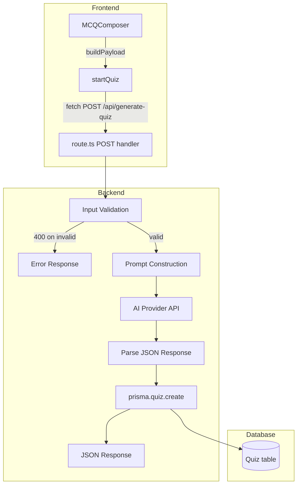
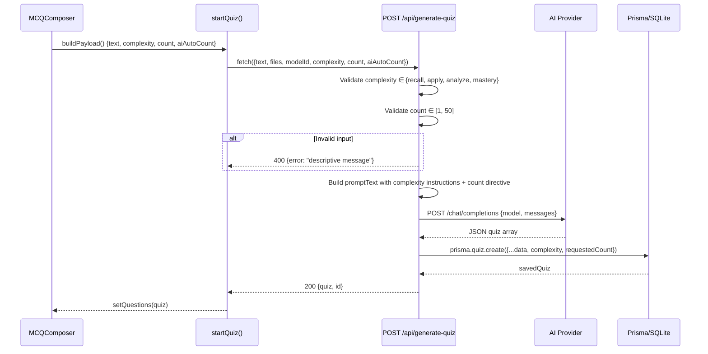

# Design Document: Sprint 1 — Quick Wins & Bug Fixes

## Overview

Sprint 1 resolves the "fake UI" problem where the MCQ composer collects complexity level and question count from the user but never transmits them as structured fields to the backend API. Currently, the frontend appends these values as text hints inside the prompt string — the backend has no awareness of them as discrete parameters and cannot validate or persist them.

This sprint makes four changes: (1) wire complexity/count as first-class JSON fields from frontend to backend, with server-side validation and prompt injection; (2) persist those fields in the database; (3) replace the boilerplate README with real documentation; (4) delete three dead files.

## Architecture



## Sequence Diagram: Quiz Generation with Complexity & Count



## Components and Interfaces

### Component 1: Frontend — `postGenerateQuiz` (StudyAssistant.jsx)

**Purpose**: Sends quiz generation request with all user-selected parameters to the backend.

**Current signature**:
```typescript
const postGenerateQuiz = async ({ text, files, modelId }) => { ... }
```

**New signature**:
```typescript
interface GenerateQuizPayload {
  text: string;
  files: InlineDataPart[];
  modelId: string;
  complexity: "recall" | "apply" | "analyze" | "mastery";
  count: number;
  aiAutoCount: boolean;
}

const postGenerateQuiz = async ({ text, files, modelId, complexity, count, aiAutoCount }: GenerateQuizPayload) => {
  const res = await fetch(buildUrl("/api/generate-quiz"), {
    method: "POST",
    headers: { "Content-Type": "application/json" },
    body: JSON.stringify({ text, files, modelId, complexity, count, aiAutoCount }),
  });
  // ...
};
```

**Changes required**:
- Add `complexity`, `count`, `aiAutoCount` to the destructured params
- Include them in `JSON.stringify` body
- Remove the frontend-side hint-line construction from `startQuiz` (move logic to backend)

### Component 2: Frontend — `startQuiz` (StudyAssistant.jsx)

**Purpose**: Orchestrates quiz generation from MCQComposer payload.

**Changes required**:
- Remove the `hints` array construction and `hintLine` concatenation (lines ~4087–4099)
- Pass `complexity`, `count`, `aiAutoCount` directly to `postGenerateQuiz`
- Keep the `promptText` as plain user text (no appended hint metadata)

**New flow**:
```typescript
// Before (current): appends hints to promptText, sends only {text, files, modelId}
// After: sends {text, files, modelId, complexity, count, aiAutoCount} as structured fields

const { status, ok, data } = await postGenerateQuiz({
  text: promptText,       // clean user text, no appended hints
  files: fileParts,
  modelId,
  complexity: p.complexity || "apply",
  count: p.count || 5,
  aiAutoCount: p.aiAutoCount || false,
});
```

### Component 3: Backend — `POST /api/generate-quiz` (route.ts)

**Purpose**: Validates inputs, constructs AI prompt with complexity/count directives, calls AI, persists quiz.

**Interface change — request body**:
```typescript
interface GenerateQuizRequest {
  text?: string;
  files?: InlineDataPart[];
  modelId?: string;
  complexity?: string;   // NEW
  count?: number;        // NEW
  aiAutoCount?: boolean; // NEW
}
```

**Validation logic**:
```typescript
const VALID_COMPLEXITIES = ["recall", "apply", "analyze", "mastery"] as const;

// Validate complexity (if provided)
if (complexity && !VALID_COMPLEXITIES.includes(complexity)) {
  return NextResponse.json(
    { error: `Invalid complexity "${complexity}". Must be one of: ${VALID_COMPLEXITIES.join(", ")}` },
    { status: 400 }
  );
}

// Validate count (if provided and aiAutoCount is false)
if (!aiAutoCount && count !== undefined) {
  if (!Number.isInteger(count) || count < 1 || count > 50) {
    return NextResponse.json(
      { error: `Invalid count "${count}". Must be an integer between 1 and 50.` },
      { status: 400 }
    );
  }
}
```

**Prompt construction** — move complexity prompts from frontend to backend:
```typescript
const COMPLEXITY_PROMPTS: Record<string, string> = {
  recall: "Generate questions that test REMEMBERING and UNDERSTANDING only. ...",
  apply: "Generate questions that test APPLICATION of knowledge. ...",
  analyze: "Generate questions that test ANALYSIS and EVALUATION. ...",
  mastery: "Generate RESEARCH-LEVEL questions that test the HIGHEST cognitive abilities. ...",
};

// Build prompt with structured directives
let promptText = `Based on the following context, create a multiple-choice quiz.
You MUST return ONLY a valid JSON array of objects. Do not include markdown wrappers.
Structure: [{"question":"...","options":["A","B","C","D"],"correctAnswer":"...","explanation":"..."}]`;

if (complexity && COMPLEXITY_PROMPTS[complexity]) {
  promptText += `\n\nComplexity rules: ${COMPLEXITY_PROMPTS[complexity]}`;
}

if (aiAutoCount) {
  promptText += `\n\nPick the optimal number of questions based on the source material depth.`;
} else if (count) {
  promptText += `\n\nGenerate exactly ${count} MCQs.`;
}

promptText += `\n\nContext: "${text || 'Generate from the provided files'}"`;
```

**Database persistence** — add fields to `prisma.quiz.create`:
```typescript
const savedQuiz = await prisma.quiz.create({
  data: {
    title: dynamicTitle,
    originalText: text || "Generated from file",
    complexity: complexity || null,        // NEW
    requestedCount: (!aiAutoCount && count) ? count : null,  // NEW
    userId: session?.user?.id || undefined,
    questions: {
      create: quizData.map((q: any) => ({
        question: q.question,
        options: JSON.stringify(q.options),
        correctAnswer: q.correctAnswer,
        explanation: q.explanation,
      })),
    },
  },
});
```

### Component 4: Database — Prisma Schema

**Purpose**: Add nullable columns to the Quiz model for complexity and requested count.

**Schema change**:
```prisma
model Quiz {
  id             String         @id @default(cuid())
  title          String
  originalText   String
  complexity     String?        // NEW — "recall" | "apply" | "analyze" | "mastery"
  requestedCount Int?           // NEW — 1..50 or null if aiAutoCount
  userId         String?
  user           User?          @relation(fields: [userId], references: [id], onDelete: Cascade)
  questions      QuizQuestion[]
  createdAt      DateTime       @default(now())
}
```

**Migration**: `npx prisma migrate dev --name add-quiz-complexity-count`

### Component 5: README.md

**Purpose**: Replace the default create-next-app boilerplate with comprehensive project documentation.

**Structure**:
```markdown
# Study Buddy

[Project description paragraph]

## Tech Stack
- Next.js 16 (App Router)
- Prisma ORM with SQLite (better-sqlite3 adapter)
- NextAuth v5 (Google OAuth)
- Tailwind CSS v4
- AI: Multi-provider via OpenAI-compatible API (NanoGPT, OpenRouter, etc.)

## Environment Variables
| Variable | Description | Required |
|----------|-------------|----------|
| GOOGLE_CLIENT_ID | Google OAuth client ID | Yes |
| GOOGLE_CLIENT_SECRET | Google OAuth client secret | Yes |
| AUTH_SECRET | NextAuth session encryption key | Yes |
| NANO_GPT_API_KEY | Default AI API key (fallback) | Yes |
| AI_API_ENDPOINT | AI API base URL | No (defaults to NanoGPT) |
| DATABASE_URL | SQLite file path | No (defaults to file:./dev.db) |

## Setup
1. Clone the repository
2. `npm install`
3. Copy `.env.local.example` to `.env.local` and fill in values
4. `npx prisma migrate dev`
5. `npm run dev`

## Project Structure
[Brief directory overview]
```

### Component 6: Dead File Cleanup

**Files to delete**:
- `nano_gpt_models.txt` — stale model list dump
- `models_output.json` — stale API response dump
- `backend_for_emergent.md` — obsolete planning doc

## Data Models

### Quiz Model (updated)

```prisma
model Quiz {
  id             String         @id @default(cuid())
  title          String
  originalText   String
  complexity     String?        // nullable — "recall" | "apply" | "analyze" | "mastery"
  requestedCount Int?           // nullable — 1..50, null when aiAutoCount=true
  userId         String?
  user           User?          @relation(fields: [userId], references: [id], onDelete: Cascade)
  questions      QuizQuestion[]
  createdAt      DateTime       @default(now())
}
```

**Validation Rules**:
- `complexity` must be one of the four allowed values or null
- `requestedCount` must be an integer in [1, 50] or null
- Both fields are nullable to maintain backward compatibility with existing quiz records

## Error Handling

### Invalid Complexity Value

**Condition**: Client sends a `complexity` value not in `["recall", "apply", "analyze", "mastery"]`
**Response**: HTTP 400 with `{ error: "Invalid complexity \"<value>\". Must be one of: recall, apply, analyze, mastery" }`
**Recovery**: Client displays the error message; user corrects selection (UI already constrains to valid values, so this is a defense-in-depth check)

### Invalid Count Value

**Condition**: Client sends `count` that is not an integer or is outside [1, 50], while `aiAutoCount` is false
**Response**: HTTP 400 with `{ error: "Invalid count \"<value>\". Must be an integer between 1 and 50." }`
**Recovery**: Client displays the error message; UI stepper already constrains to [1, 50]

### Missing Parameters (Graceful Defaults)

**Condition**: `complexity` or `count` not provided in request body
**Response**: Backend proceeds with no complexity instruction and no count directive (backward-compatible behavior)
**Recovery**: N/A — this is the fallback path for older clients

## Testing Strategy

### Unit Testing Approach

- Validate that the API route rejects invalid complexity values with 400
- Validate that the API route rejects out-of-range count values with 400
- Validate that valid requests pass through to prompt construction
- Validate that `aiAutoCount=true` causes count to be ignored in prompt

### Property-Based Testing Approach

**Property Test Library**: fast-check (JavaScript)

- For any valid complexity value, the constructed prompt must contain the corresponding complexity instruction text
- For any count in [1, 50] with aiAutoCount=false, the prompt must contain "Generate exactly N MCQs"
- For any request with aiAutoCount=true, the prompt must NOT contain a specific count directive

### Integration Testing Approach

- End-to-end: submit quiz from UI with complexity=mastery, count=10 → verify prompt sent to AI contains mastery instructions and "exactly 10 MCQs"
- Database: after successful generation, verify Quiz record has correct `complexity` and `requestedCount` values

## Correctness Properties

*A property is a characteristic or behavior that should hold true across all valid executions of a system — essentially, a formal statement about what the system should do. Properties serve as the bridge between human-readable specifications and machine-verifiable correctness guarantees.*

### Property 1: Complexity injection correctness

For any valid complexity value `c` in `["recall", "apply", "analyze", "mastery"]`, when the API receives a request with `complexity = c`, the constructed prompt text SHALL contain the full complexity instruction string corresponding to `c`.

**Validates: Requirements 1.2**

### Property 2: Count injection correctness

For any integer `n` in [1, 50] and `aiAutoCount = false`, when the API receives a request with `count = n`, the constructed prompt text SHALL contain the substring `Generate exactly ${n} MCQs`.

**Validates: Requirements 1.3**

### Property 3: AI auto-count ignores explicit count

For any request where `aiAutoCount = true`, regardless of the `count` value provided, the constructed prompt text SHALL NOT contain a specific numeric count directive and SHALL contain the auto-count instruction.

**Validates: Requirements 1.4**

### Property 4: Invalid complexity rejection

For any string `s` that is NOT in `["recall", "apply", "analyze", "mastery"]`, when the API receives a request with `complexity = s`, it SHALL return HTTP 400.

**Validates: Requirements 1.5**

### Property 5: Invalid count rejection

For any value `v` where `v` is not an integer in [1, 50], when the API receives a request with `count = v` and `aiAutoCount = false`, it SHALL return HTTP 400.

**Validates: Requirements 1.6**

### Property 6: Database persistence round-trip

For any successfully generated quiz with `complexity = c` and `count = n`, querying the Quiz record from the database SHALL return `complexity = c` and `requestedCount = n`.

**Validates: Requirements 2.3**

### Property 7: Null persistence for missing parameters

For any request where `complexity` is not provided, the persisted Quiz record SHALL have `complexity = null`. For any request where `aiAutoCount = true`, the persisted Quiz record SHALL have `requestedCount = null`.

**Validates: Requirements 2.4**
