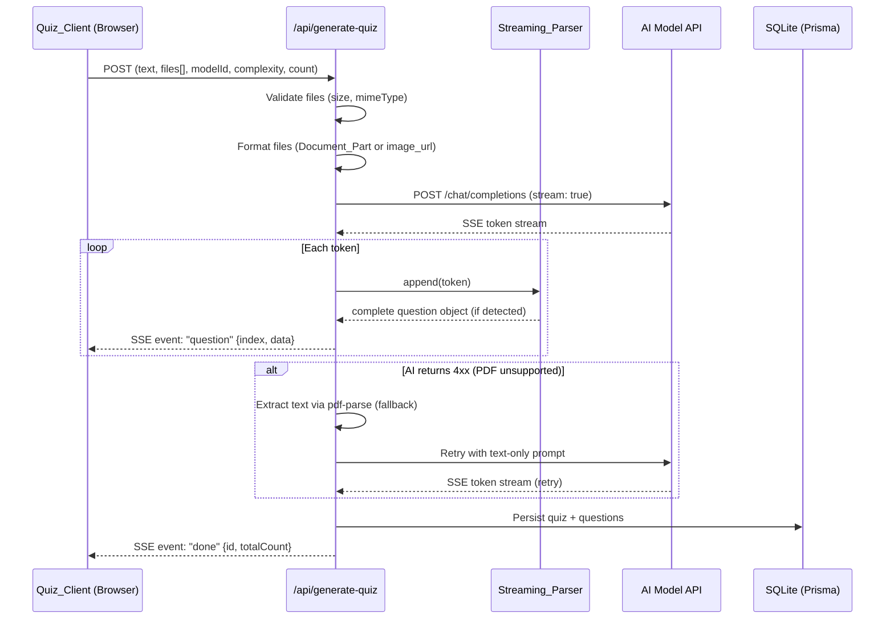

# Design Document: Sprint 2 — PDF Upload & Quiz Streaming

## Overview

This design extends the existing `/api/generate-quiz` route with two capabilities:

1. **PDF Upload Handling** — Detect PDF files by MIME type, format them as document parts for AI models that support native PDF, and fall back to server-side text extraction via `pdf-parse` when the model rejects the document format.
2. **SSE Streaming** — Replace the current synchronous JSON response with a Server-Sent Events stream that emits individual quiz questions as they are parsed from the AI model's streamed response, enabling progressive rendering on the client.

The architecture preserves backward compatibility with the existing quiz persistence model (Prisma `Quiz` + `QuizQuestion` tables) and reuses the SSE pattern already established in the `/api/chat` route.

## Architecture



### Key Design Decisions

1. **Single endpoint, streaming by default** — The generate-quiz route switches from returning `application/json` to `text/event-stream`. The client must be updated to consume SSE instead of awaiting a JSON response.

2. **Fallback is transparent** — The PDF text extraction fallback happens server-side. The client doesn't need to know whether native PDF or extracted text was used.

3. **Parser as a pure module** — The `Streaming_Parser` is implemented as a standalone, testable module with no I/O dependencies. It accepts tokens and emits parsed question objects via a callback pattern.

4. **Persistence after stream completion** — The quiz is saved to the database only after the stream ends (all questions collected), matching the current behavior where the full quiz is saved atomically.

## Components and Interfaces

### 1. File Router (`src/lib/quiz/file-router.ts`)

Responsible for validating and formatting file payloads based on MIME type.

```typescript
interface FilePayload {
  inlineData: {
    mimeType: string;
    data: string; // base64-encoded
  };
}

interface DocumentPart {
  type: "document";
  document: {
    mimeType: string;
    data: string; // base64
  };
}

interface ImageUrlPart {
  type: "image_url";
  image_url: {
    url: string; // data:mimeType;base64,data
  };
}

type FormattedFilePart = DocumentPart | ImageUrlPart;

// Validates mimeType and file size, returns formatted part or throws
function formatFilePart(file: FilePayload): FormattedFilePart;

// Validates all files in a request payload
function validateAndFormatFiles(files: FilePayload[]): FormattedFilePart[];
```

### 2. PDF Extractor (`src/lib/quiz/pdf-extractor.ts`)

Extracts text from base64-encoded PDF data using `pdf-parse`.

```typescript
interface ExtractionResult {
  text: string;
  pageCount: number;
}

// Decodes base64, passes buffer to pdf-parse, returns extracted text
async function extractTextFromPdf(base64Data: string): Promise<ExtractionResult>;

// Extracts text from multiple PDFs, concatenates with newline separator
async function extractTextFromMultiplePdfs(files: FilePayload[]): Promise<string>;
```

### 3. Streaming Parser (`src/lib/quiz/streaming-parser.ts`)

Accumulates AI model tokens and detects complete JSON question objects.

```typescript
interface QuizQuestion {
  question: string;
  options: string[];
  correctAnswer: string;
  explanation: string;
}

interface StreamingParserCallbacks {
  onQuestion: (question: QuizQuestion, index: number) => void;
  onError: (message: string) => void;
  onDone: (questions: QuizQuestion[], warnings: string[]) => void;
}

class StreamingParser {
  private buffer: string;
  private questions: QuizQuestion[];
  private warnings: string[];
  
  constructor(callbacks: StreamingParserCallbacks);
  
  // Append a token to the buffer and attempt extraction
  push(token: string): void;
  
  // Signal end of stream — flush buffer, emit done
  end(): void;
  
  // Get current buffer size in bytes
  getBufferSize(): number;
}
```

### 4. Updated Generate-Quiz Route (`src/app/api/generate-quiz/route.ts`)

The route handler orchestrates file validation, AI streaming, parsing, persistence, and SSE emission.

```typescript
// SSE event types emitted to the client
type SSEEventType = "question" | "done" | "error";

interface QuestionEvent {
  index: number;
  data: QuizQuestion;
}

interface DoneEvent {
  id: string | null;
  totalCount: number;
  incomplete: boolean;
  warnings?: string[];
  // If DB save fails, include full quiz data for client recovery
  fallbackData?: QuizQuestion[];
}

interface ErrorEvent {
  message: string;
}
```

### 5. Quiz Client Hook (`src/hooks/useQuizStream.ts`)

A React hook that manages the SSE connection and progressive state.

```typescript
interface UseQuizStreamOptions {
  onQuestion?: (question: QuizQuestion, index: number) => void;
  onDone?: (event: DoneEvent) => void;
  onError?: (message: string) => void;
}

interface UseQuizStreamReturn {
  questions: QuizQuestion[];
  isStreaming: boolean;
  error: string | null;
  totalCount: number | null;
  quizId: string | null;
  startStream: (payload: QuizGeneratePayload) => void;
  abort: () => void;
}

function useQuizStream(options?: UseQuizStreamOptions): UseQuizStreamReturn;
```

## Data Models

No schema changes are required. The existing Prisma models support the streaming flow:

```prisma
model Quiz {
  id             String         @id @default(cuid())
  title          String
  originalText   String
  complexity     String?
  requestedCount Int?
  userId         String?
  user           User?          @relation(fields: [userId], references: [id], onDelete: Cascade)
  questions      QuizQuestion[]
  createdAt      DateTime       @default(now())
}

model QuizQuestion {
  id            String @id @default(cuid())
  question      String
  options       String   // JSON-stringified string[]
  correctAnswer String
  explanation   String
  quiz          Quiz   @relation(fields: [quizId], references: [id], onDelete: Cascade)
  quizId        String
}
```

The only behavioral change is that persistence happens after stream completion rather than after a single JSON response parse. The data shape is identical.

### SSE Wire Format

```
event: question
data: {"index":0,"data":{"question":"...","options":["A","B","C","D"],"correctAnswer":"B","explanation":"..."}}

event: question
data: {"index":1,"data":{"question":"...","options":["A","B","C","D"],"correctAnswer":"A","explanation":"..."}}

event: done
data: {"id":"clxyz123","totalCount":2,"incomplete":false}

```

Error case:
```
event: error
data: {"message":"AI model returned token limit exceeded"}

```

## Correctness Properties

*A property is a characteristic or behavior that should hold true across all valid executions of a system — essentially, a formal statement about what the system should do. Properties serve as the bridge between human-readable specifications and machine-verifiable correctness guarantees.*

### Property 1: File routing by MIME type

*For any* file payload, if its `inlineData.mimeType` equals `"application/pdf"` the formatter SHALL produce a `DocumentPart`, if it starts with `"image/"` the formatter SHALL produce an `ImageUrlPart`, and for any other mimeType (or missing mimeType) the formatter SHALL throw an error indicating unsupported file type.

**Validates: Requirements 1.1, 1.2, 1.3, 1.4**

### Property 2: Extracted text ordering in prompt

*For any* user-provided text string and any non-empty extracted PDF text string, the final prompt context SHALL contain the user text followed by the extracted text, with the user text appearing at a lower index position than the extracted text.

**Validates: Requirements 2.2**

### Property 3: Whitespace-only extraction rejection

*For any* string composed entirely of whitespace characters (spaces, tabs, newlines, carriage returns), the PDF extractor validation SHALL reject it and signal an error, leaving the system state unchanged.

**Validates: Requirements 2.3**

### Property 4: Base64 decode round-trip and multi-PDF concatenation

*For any* array of PDF file payloads where each contains base64-encoded data, the extractor SHALL decode each file's base64 data to produce the original binary buffer, and when multiple files are present, the concatenated extraction result SHALL equal the individual extractions joined by newline characters in the original array order.

**Validates: Requirements 2.5, 2.6**

### Property 5: File size validation boundary

*For any* base64-encoded file payload, the validator SHALL accept the file if and only if its decoded byte length is less than or equal to 10,485,760 bytes. Files exceeding this threshold SHALL be rejected with an HTTP 413 status.

**Validates: Requirements 3.1, 3.2**

### Property 6: Streaming parser equivalence to batch parsing

*For any* valid AI response string containing N question objects (each with question, options, correctAnswer, and explanation fields), splitting the string into arbitrary token chunks and feeding them sequentially through the Streaming_Parser SHALL produce the same N question objects in the same order with deep-equal field values as parsing the complete string with `JSON.parse`.

**Validates: Requirements 7.1, 7.2, 7.6**

### Property 7: Markdown fence stripping preserves content

*For any* valid JSON array of question objects, wrapping it in any combination of markdown code fences (` ```json `, ` ```JSON `, ` ``` `) and feeding it through the Streaming_Parser SHALL produce the same parsed questions as feeding the unwrapped JSON.

**Validates: Requirements 7.3**

### Property 8: Malformed question resilience

*For any* stream containing a mix of K valid question objects and M malformed objects (missing required fields or invalid JSON fragments), the Streaming_Parser SHALL emit exactly K valid questions in their original order and report M skipped questions in the warnings.

**Validates: Requirements 4.8**

### Property 9: Quiz persistence completeness

*For any* set of N successfully parsed question objects (where N ≥ 1) produced during a stream, the persisted Quiz record SHALL contain exactly N QuizQuestion records, each with field values matching the parsed objects, and the quiz title SHALL not exceed 50 characters.

**Validates: Requirements 6.1, 6.4**

### Property 10: SSE question event sequential indexing

*For any* sequence of N questions emitted by the Streaming_Parser, the SSE events SHALL have sequential indices from 0 to N-1, with each event containing the correct question data at its corresponding position.

**Validates: Requirements 4.2**

## Error Handling

| Scenario | HTTP Status | SSE Event | Recovery |
|----------|-------------|-----------|----------|
| Invalid/missing mimeType | 400 (pre-stream) | N/A | Client shows validation error |
| File exceeds 10 MB | 413 (pre-stream) | N/A | Client shows size error |
| Missing API key | 401 (pre-stream) | N/A | Client prompts for API key |
| AI API 4xx on PDF (first attempt) | — | — | Automatic retry with extracted text |
| pdf-parse extraction failure | 422 (pre-stream) | N/A | Client shows extraction error |
| Empty PDF text after extraction | 422 (pre-stream) | N/A | Client shows "no extractable text" |
| AI API error during stream | — | `error` event | Client displays error, shows any received questions |
| 30-second stream timeout | — | `error` event | Client displays timeout, shows any received questions |
| Client disconnect | — | — | Server aborts upstream request, releases resources |
| Malformed question in stream | — | Skipped | Continue streaming; report in `done` warnings |
| Buffer overflow (>512 KB) | — | `error` event | Client displays error, shows any received questions |
| Database save failure | — | `done` with null ID | Client receives full quiz data in `done` payload |

### Pre-stream vs In-stream Errors

Errors detected before the SSE stream begins (file validation, API key check, PDF extraction failure) return standard JSON error responses with appropriate HTTP status codes. This allows the client to handle them with the same error UI pattern used today.

Errors that occur after the stream has started (AI failures, timeouts, malformed data) are communicated via SSE `error` events since HTTP status has already been sent as 200.

## Testing Strategy

### Property-Based Tests (via `fast-check`)

The project will use [`fast-check`](https://github.com/dubzzz/fast-check) for property-based testing. Each property test runs a minimum of 100 iterations with randomized inputs.

**Target modules for PBT:**
- `src/lib/quiz/file-router.ts` — Properties 1, 5
- `src/lib/quiz/pdf-extractor.ts` — Properties 2, 3, 4
- `src/lib/quiz/streaming-parser.ts` — Properties 6, 7, 8, 10
- `src/app/api/generate-quiz/route.ts` (persistence logic) — Property 9

**Test configuration:**
- Minimum 100 iterations per property
- Each test tagged with: `Feature: sprint2-pdf-streaming, Property {N}: {title}`
- Tests located in `src/lib/quiz/__tests__/` directory

### Unit Tests (Example-Based)

- PDF fallback retry logic (mock AI API returning 4xx, verify single retry)
- `pdf-parse` error handling (mock library throwing)
- SSE response headers verification
- Done event format with successful DB save
- Done event format with failed DB save (null ID, full data)
- Stream timeout after 30 seconds of inactivity
- Client disconnect cleanup
- Zero questions in done event → error indication

### Integration Tests

- End-to-end: upload PDF → stream questions → verify DB persistence
- Fallback flow: PDF upload → 4xx from AI → text extraction → retry → stream
- Client SSE consumption: verify EventSource receives events in correct order

### Frontend Tests

- `useQuizStream` hook: progressive question accumulation
- Error state transitions (error event, connection loss)
- File size validation in MCQ_Composer (client-side 10MB check)
- CSS animation class application on new question render
- Progress indicator visibility during streaming
